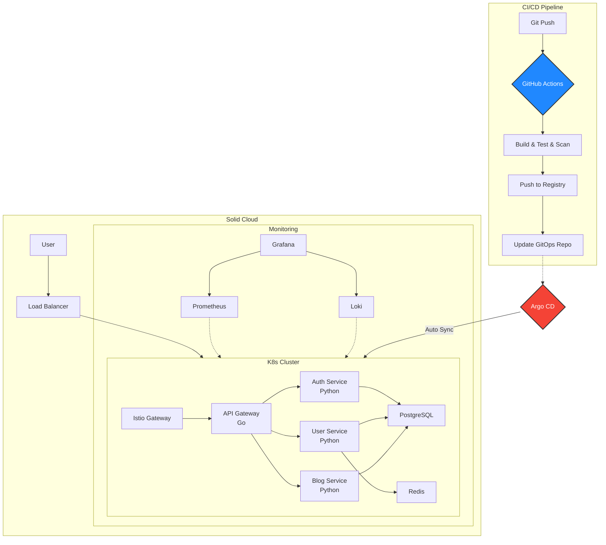

# Cloud-Native 마이크로서비스 플랫폼 v2.0

**문서 버전**: 2.0  
**최종 수정일**: 2025년 10월 13일

로컬 환경(Minikube)에서 운영되던 마이크로서비스 블로그 플랫폼을 클라우드 네이티브 아키텍처로 재구축한 프로젝트입니다. Terraform을 이용한 인프라 자동화, GitOps 기반의 CI/CD 파이프라인, 그리고 Istio 서비스 메시를 통한 관측성과 보안 강화를 목표로 합니다.

---

## 문서 변경 이력

| 문서 버전 | 날짜 | 주요 변경 내용 |
|----------|------|---------------|
| **1.0** | 2025-09-29 | 초안 작성 (AWS EKS 기반 아키텍처) |
| **2.0** | 2025-10-13 | 단국대학교 자체 클라우드(Solid Cloud) 개발/테스트 후 AWS는 최종 배포하는 것으로 변경 |

---

## 프로젝트 배경

### v1.0의 한계
- 로컬 환경(Minikube)에서만 동작
- 수동으로 인프라를 구성하고 관리 (IaC 미적용)
- CI/CD 파이프라인이 없어 배포를 수동으로 진행
- 파일 기반 DB(SQLite) 사용으로 확장 불가능

### v2.0에서 개선한 점
- **Solid Cloud 기반 실제 클라우드 환경 구축**
- **Terraform으로 인프라를 코드로 관리 (IaC)**
- **GitHub Actions + Argo CD로 자동화된 배포 파이프라인**
- **PostgreSQL로 전환하여 데이터 정합성 및 확장성 확보**
- **Prometheus + Grafana + Loki로 시스템 모니터링 구축**
- **Istio를 통한 서비스 간 보안 통신(mTLS) 적용**

---

## 주요 기능

-   **Infrastructure as Code (IaC)**: Terraform을 사용하여 Solid Cloud의 Kubernetes 클러스터, 네트워크, 스토리지 등을 코드로 정의하고 자동으로 생성합니다.
-   **GitOps CI/CD 파이프라인**: GitHub에 코드를 Push하면 자동으로 빌드, 테스트, 보안 스캔을 거쳐 Solid Cloud에 배포됩니다.
-   **마이크로서비스 아키텍처**: Go와 Python(FastAPI)을 활용한 폴리글랏 MSA 구조로 각 서비스를 독립적으로 개발하고 배포합니다.
-   **관측성 (Observability)**: Prometheus, Grafana, Loki를 도입하여 시스템의 메트릭과 로그를 실시간으로 모니터링합니다.
-   **서비스 메시**: Istio를 적용하여 서비스 간 통신을 자동으로 암호화하고 트래픽을 세밀하게 제어합니다.
-   **데이터 영속성**: PostgreSQL과 Redis를 사용하여 안정적인 데이터 저장과 빠른 캐싱을 지원합니다.

---

## 아키텍처 다이어그램

### 전체 시스템 구조 (Solid Cloud 기반)



---

## 시작하기

이 프로젝트는 **로컬 개발 환경**과 **Solid Cloud 프로덕션 환경** 두 가지 방식으로 실행할 수 있습니다.

### 옵션 1: 로컬 개발 환경 (Minikube + Skaffold)

빠른 개발 및 테스트를 위한 로컬 쿠버네티스 환경입니다.

**요구사항:** `Minikube`, `Skaffold`, `kubectl`

```bash
# 1. Minikube 클러스터 시작
minikube start

# 2. Skaffold 개발 모드 실행
skaffold dev

# 3. 서비스 접속
minikube service load-balancer-service --url
```

---

### 옵션 2: Solid Cloud 프로덕션 환경

실제 클라우드 환경에서 Terraform으로 인프라를 생성하고 GitOps 방식으로 배포합니다.

**요구사항:** `Terraform`, `kubectl`, Solid Cloud 접근 권한

```bash
# 1. Terraform으로 인프라 생성
cd terraform/environments/dev
terraform init
terraform apply

# 2. kubectl 설정
# Solid Cloud에서 제공하는 kubeconfig 파일 다운로드
export KUBECONFIG=~/solid-cloud-kubeconfig.yaml

# 3. Argo CD 설치
kubectl create namespace argocd
kubectl apply -n argocd -f https://raw.githubusercontent.com/argoproj/argo-cd/stable/manifests/install.yaml

# 4. GitOps 배포
# 이후 Git Push만으로 자동 배포
```

---

## 프로젝트 문서

체계적인 문서화를 통해 프로젝트의 요구사항, 설계, 기술 결정 과정을 기록했습니다.

-   **[요구사항 명세서](./docs/requirements.md)**: 프로젝트에서 구현할 기능과 목표
-   **[시스템 설계서](./docs/architecture.md)**: 시스템 아키텍처와 구조
-   **[프로젝트 계획서](./docs/project-plan.md)**: 개발 일정과 마일스톤
-   **[기술 결정 기록 (ADR)](./docs/adr/)**: 주요 기술 선택의 이유와 배경

---

## 기술 스택

| 구분                | 기술                                                                                              |
| ------------------- | ------------------------------------------------------------------------------------------------- |
| **Cloud**           | `Solid Cloud (단국대학교)`, `Kubernetes`                                                           |
| **IaC**             | `Terraform`                                                                                       |
| **CI/CD**           | `GitHub Actions`, `Argo CD`                                                                       |
| **Container**       | `Docker`, `Kustomize`                                                                             |
| **Service Mesh**    | `Istio`                                                                                           |
| **Monitoring**      | `Prometheus`, `Grafana`, `Loki`                                                                   |
| **Backend**         | `Go`, `Python`, `FastAPI`                                                                         |
| **Database/Cache**  | `PostgreSQL`, `Redis`                                                                             |
| **Local Dev**       | `Minikube`, `Skaffold`                                                                            |

**각 기술을 선택한 이유는 [ADR 문서](./docs/adr/)를 참고하세요.**

---

## 개발 계획 및 목표

### 개발 기간
- **프로젝트 기간**: 5주 (2025년 9월 29일 ~ 10월 31일)
- **테스트 환경**: Solid Cloud
- **최종 배포**: AWS (선택사항, 모든 테스트 완료 후)

### 성능 목표
- **응답 시간**: 100 RPS에서 P95 응답시간 < 500ms
- **테스트 커버리지**: 70% 이상
- **보안**: 컨테이너 이미지 취약점 스캔 통과 (HIGH/CRITICAL 0개)
- **배포 시간**: Git Push 후 5분 이내 자동 배포

---

## 프로젝트 진행 상황

### 완료된 항목
- [x] 로컬 개발 환경 구축 (Minikube + Skaffold)
- [x] 마이크로서비스 기본 구조 설계
- [ ] Solid Cloud 인프라 구축 (Terraform)
- [ ] CI/CD 파이프라인 구축
- [ ] PostgreSQL 적용 및 데이터 마이그레이션
- [ ] 모니터링 시스템 구축
- [ ] Istio 서비스 메시 적용

---

## 참고 사항
- 개발 및 테스트는 Solid Cloud를 활용하여 진행합니다.
- 모든 테스트가 완료되면 AWS로의 배포를 고려할 예정입니다.