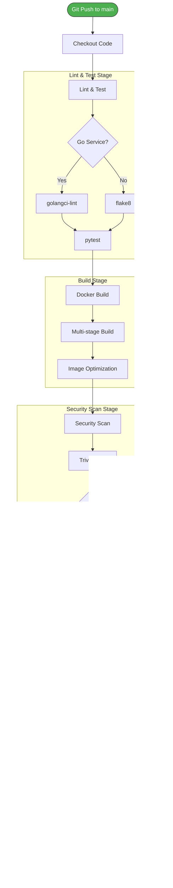

# Cloud-Native 마이크로서비스 플랫폼 시스템 설계서

**문서 버전**: 2.0  
**작성일**: 2025년 10월 13일

---

## 문서 변경 이력

| 문서 버전 | 날짜 | 주요 변경 내용 | 영향 받는 섹션 |
|----------|------|---------------|---------------|
| **1.0** | 2025-09-30 | 초안 작성 (AWS 기반 설계) | 전체 아키텍처를 AWS EKS 환경 기준으로 작성 |
| **2.0** | 2025-10-13 | **AWS VPC → Solid Cloud 네트워크 구성**으로 변경, **AWS EKS → Solid Cloud Kubernetes**로 변경, | 전체 시스템 아키텍처, Solid Cloud 구성|

---

## 1. 시스템 개요

### 1.1. 아키텍처 원칙

본 프로젝트는 다음의 핵심 원칙을 따라 설계되었습니다:

- **Infrastructure as Code (IaC)**  
  모든 인프라를 Terraform 코드로 정의하여 재현 가능하고 일관된 환경을 구축합니다.

- **GitOps**  
  Git 저장소를 유일한 신뢰 소스(Single Source of Truth)로 삼아 모든 배포를 자동화합니다.

- **Observability (관측성)**  
  메트릭, 로그, 트레이스를 수집하여 시스템 상태를 명확히 파악할 수 있도록 합니다.

- **Security by Default**  
  모든 통신은 암호화를 기본으로 하며, 최소 권한 원칙을 따릅니다.

### 1.2. 기술 스택

- **Cloud Platform**: Solid Cloud (CloudStack 기반)
- **Container Orchestration**: Kubernetes
- **IaC**: Terraform
- **CI/CD**: GitHub Actions, Argo CD
- **Service Mesh**: Istio
- **Monitoring**: Prometheus, Grafana
- **Logging**: Loki, Promtail
- **Application**: Go, Python (FastAPI)
- **Database**: PostgreSQL, Redis

> **참고**: 각 기술을 선택한 이유는 `docs/adr/` 디렉토리의 기술 결정 기록(ADR)을 참고하세요.

### 1.3. 문서 구조

본 설계서는 시스템 아키텍처의 **핵심 개념과 구조**를 설명합니다.

**상세 구현 정보는 다음 위치를 참고하세요:**
- **Terraform 코드**: `terraform/` 디렉토리
- **Kubernetes 매니페스트**: `k8s-manifests/` 디렉토리
- **CI/CD 스크립트**: `.github/workflows/` 디렉토리
- **서비스 소스 코드**: 각 서비스 디렉토리의 README

---

## 2. 전체 시스템 아키텍처

### 2.1. 아키텍처 다이어그램


**주요 특징:**

1. **CI Pipeline (GitHub Actions)**
   - 코드 Push 시 자동으로 빌드, 테스트, 보안 스캔 수행
   - 컨테이너 이미지를 빌드하여 레지스트리에 Push
   - GitOps Config 저장소의 이미지 태그를 자동 업데이트

2. **CD Pipeline (Argo CD)**
   - GitOps Config 변경을 감지하여 자동 동기화
   - Kubernetes 클러스터에 모든 리소스를 선언적으로 배포
   - 실제 이미지 Pull은 Kubernetes 노드의 Kubelet이 수행

3. **Service Mesh (Istio)**
   - 모든 서비스 간 통신을 mTLS로 자동 암호화
   - 트래픽 라우팅 및 로드 밸런싱
   - 메트릭 수집 및 관측성 제공

4. **Monitoring Stack**
   - Prometheus: 메트릭 수집 및 저장
   - Grafana: 시각화 및 대시보드
   - Loki: 중앙 로그 수집 및 조회

### 2.2. 실제 서비스 메시 토폴로지 (Kiali)

위의 mermaid 다이어그램은 설계상의 아키텍처를 보여주며, 아래 Kiali 스크린샷은 실제로 동작하는 시스템의 서비스 간 상호작용과 트래픽 흐름을 실시간으로 시각화합니다.


**Kiali를 통해 확인 가능한 정보:**
- 서비스 간 실시간 트래픽 흐름 및 요청 수
- mTLS STRICT 모드로 암호화된 통신 상태
- 각 서비스의 응답 시간 및 에러율
- Istio Ingress Gateway를 통한 외부 트래픽 진입 경로
- Load Generator가 생성하는 지속적인 테스트 트래픽

### 2.3. 네트워크 구조

#### Kubernetes 클러스터 구성
- **네임스페이스 구조**
  - `titanium-prod`: 애플리케이션 서비스
  - `monitoring`: Prometheus, Grafana, Loki
  - `istio-system`: Istio 컴포넌트
  - `argocd`: Argo CD

#### 서비스 통신
- **외부 → 클러스터**: Istio Ingress Gateway (NodePort)
- **서비스 간**: Istio Service Mesh (mTLS 암호화)
- **DB 접근**: 각 서비스 → PostgreSQL Service

---

### 2.4. 성능 목표 (Non-Functional Requirements)

본 시스템은 아래와 같은 성능 및 안정성 목표를 가집니다.

- **응답 시간 (Latency)**: 모든 사용자 요청에 대해 신속하게 응답하는 것을 목표로 하며, 특히 주요 API는 낮은 지연 시간을 유지합니다.
- **처리량 (Throughput)**: 대규모 트래픽이 발생하는 상황에서도 안정적으로 요청을 처리할 수 있는 처리량을 확보합니다.
- **가용성 (Availability)**: 시스템의 주요 기능은 24/7 중단 없이 사용 가능해야 하며, 장애 발생 시 빠른 복구를 목표로 합니다.
- **확장성 (Scalability)**: 사용자 및 트래픽 증가에 유연하게 대응할 수 있도록 수평적 확장이 가능한 구조를 지향합니다.

---

## 3. 마이크로서비스 구조

### 3.1. 서비스 목록

| 서비스명 | 언어 | 역할 | 주요 기능 |
|---------|------|------|----------|
| **API Gateway** | Go | 라우팅 및 부하 분산 | 요청 라우팅, Rate Limiting |
| **Auth Service** | Python | 인증/인가 | JWT 토큰 발급/검증 |
| **User Service** | Python | 사용자 관리 | 회원가입, 프로필 관리 |
| **Blog Service** | Python | 블로그 관리 | 게시글 CRUD, 검색 |

### 3.2. 데이터 저장소

- **PostgreSQL**: 사용자 정보, 블로그 게시글 등 영속 데이터
- **Redis**: 세션 정보, 캐시 데이터

### 3.3. 데모/테스트 컴포넌트

- **Load Generator**: 모니터링 시스템의 실시간 동작을 시연하기 위한 트래픽 생성기
  - 역할: 1초마다 API Gateway, Auth Service, Blog Service로 HTTP 요청 전송
  - 배포: 2개 replica로 지속적인 트래픽 생성
  - 목적: Grafana 대시보드의 실시간 메트릭 시각화 및 모니터링 시스템 검증
  - 기술: curl 기반 컨테이너 (Istio sidecar 주입)

### 3.4. 서비스 간 통신 흐름

#### 사용자 요청 처리 흐름


**주요 특징:**
- **mTLS 암호화**: Istio Service Mesh를 통해 모든 서비스 간 통신이 자동으로 암호화됩니다.
- **중앙 인증**: Auth Service에서 JWT 토큰을 검증하여 인증을 중앙화합니다.
- **캐시 레이어**: User Service는 Redis를 활용하여 자주 조회되는 데이터를 캐싱합니다.
- **데이터베이스 접근**: 각 서비스는 필요한 경우에만 PostgreSQL에 접근합니다.

---

## 4. CI/CD 파이프라인

### 4.1. CI 파이프라인 (GitHub Actions)

**트리거**: `main` 브랜치에 코드 Push



**실행 단계**:
1. **Lint & Test**
   - `golangci-lint` (Go 서비스)
   - `flake8`, `pytest` (Python 서비스)

2. **Build**
   - Docker 멀티 스테이지 빌드
   - 경량화된 이미지 생성

3. **Security Scan**
   - Trivy로 이미지 취약점 스캔
   - HIGH/CRITICAL 발견 시 빌드 실패

4. **Push**
   - 컨테이너 레지스트리에 이미지 업로드

5. **Update Manifests**
   - GitOps 저장소의 이미지 태그 업데이트
   - 자동 커밋 및 푸시

### 4.2. CD 파이프라인 (Argo CD)


**동작 방식**:
- GitOps 저장소를 주기적으로 모니터링 (기본 3분 간격)
- 변경 사항 감지 시 자동으로 Kubernetes에 배포
- 배포 상태를 UI에서 실시간 확인 가능
- Self-Heal 기능으로 수동 변경 사항을 Git 상태로 자동 복구
- Health Check 실패 시 자동 롤백 기능 활용

**주요 설정**:
- `Sync Policy`: Automated (자동 동기화)
- `Prune`: true (Git에서 삭제된 리소스 자동 제거)
- `Self Heal`: true (수동 변경 시 Git 상태로 자동 복구)

**롤백 전략**:
- Pod의 Health Check (Readiness/Liveness Probe) 실패 시 Kubernetes가 자동으로 이전 버전으로 롤백
- Argo CD는 배포 실패를 감지하고 상태를 보고
- 수동 롤백도 Argo CD UI 또는 CLI를 통해 가능

---

## 5. 모니터링 및 로깅

### 5.1. Prometheus + Grafana (메트릭)

**수집 메트릭**:
- 애플리케이션 메트릭: 요청 수, 응답 시간, 에러율
- 인프라 메트릭: CPU, 메모리, 네트워크, 디스크

**주요 대시보드**:
- Golden Signals (Latency, Traffic, Errors, Saturation)
- Kubernetes 클러스터 상태
- 서비스별 상세 메트릭

### 5.2. Loki + Promtail (로그)

**로그 수집 방식**:
- Promtail이 각 노드에서 컨테이너 로그 수집
- Loki에 저장 후 Grafana에서 조회

**장점**:
- Prometheus와 동일한 라벨 시스템 사용
- Grafana에서 메트릭과 로그를 함께 확인

---

## 6. 보안 설계

### 6.1. Istio mTLS

- 서비스 간 모든 통신을 자동으로 암호화
- 애플리케이션 코드 수정 없이 적용
- `PeerAuthentication` 정책: STRICT 모드

### 6.2. Network Policy

- Kubernetes Network Policy로 Pod 간 통신 제한
- 예: Blog Service는 PostgreSQL의 5432 포트만 접근 가능

### 6.3. Secrets 관리

- 데이터베이스 비밀번호 등 민감 정보는 Kubernetes Secrets에 저장
- 환경 변수로 Pod에 주입

---

## 7. Solid Cloud 구성

### 7.1. 개발 환경

**목적**: 개발 및 테스트 환경

**구성**:
- Kubernetes 클러스터: 3 노드
- 네임스페이스: 기능별로 분리
- 리소스 제한: 각 서비스별 CPU/메모리 제한 설정

### 7.2. AWS 전환 고려사항

**Solid Cloud 테스트 완료 후 AWS 배포 시 변경 사항**:
- EKS 클러스터 사용
- AWS ALB를 Ingress Controller로 사용
- ECR을 컨테이너 레지스트리로 사용
- RDS를 PostgreSQL로 사용 (선택사항)

---

## 8. 참고 문서

- **[요구사항 명세서](./requirements.md)**
- **[프로젝트 계획서](./project-plan.md)**
- **[기술 결정 기록 (ADR)](./adr/)**

---

## 부록: 주요 명령어

### Terraform
```bash
# 인프라 생성
terraform init
terraform plan
terraform apply

# 인프라 삭제
terraform destroy
```

### Kubernetes
```bash
# Pod 상태 확인
kubectl get pods -A

# 로그 확인
kubectl logs <pod-name>

# 서비스 확인
kubectl get svc
```

### Argo CD
```bash
# 배포 상태 확인
kubectl get applications -n argocd

# 수동 동기화
kubectl patch application <app-name> -n argocd -p '{"operation":{"initiatedBy":{"username":"admin"},"sync":{"syncStrategy":{"hook":{}}}}}' --type merge
```