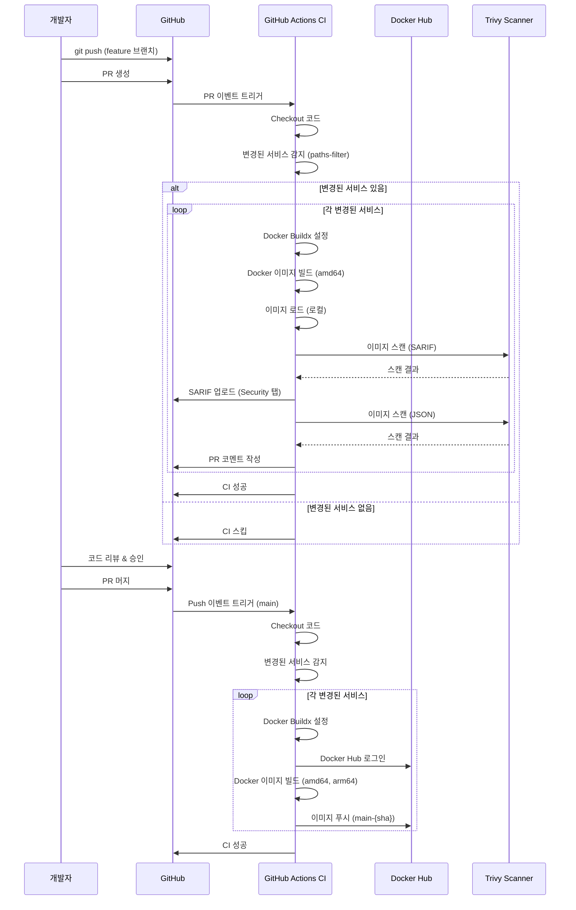
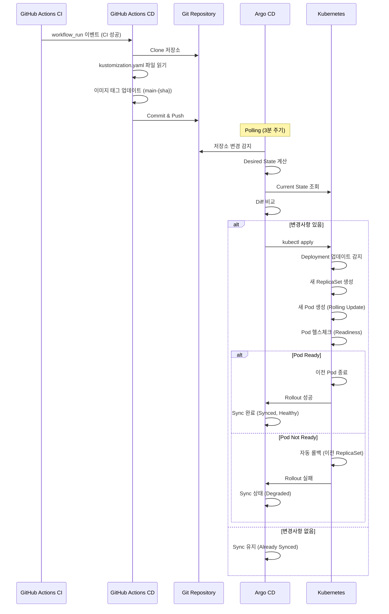
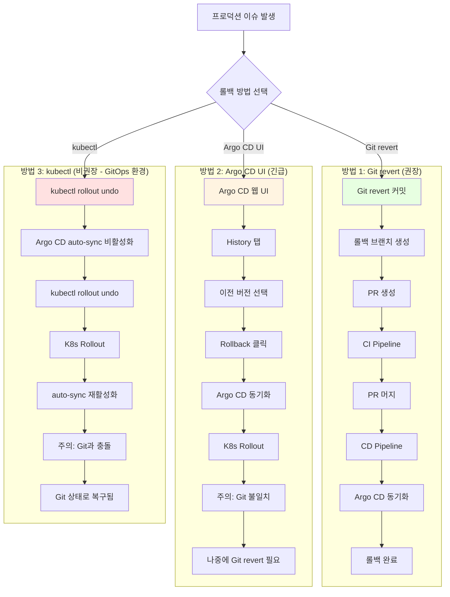
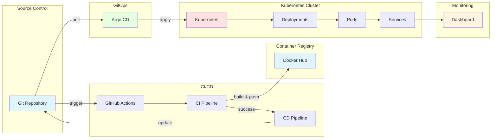

# CI/CD 플로우 다이어그램

## 전체 CI/CD 파이프라인 흐름

```mermaid
graph TB
    Start[개발자: 코드 변경] --> Branch[Feature 브랜치 생성]
    Branch --> PR[Pull Request 생성]
    
    PR --> CI_PR[CI Pipeline - PR]
    
    subgraph "CI Pipeline (PR 브랜치)"
        CI_PR --> Detect1[변경된 서비스 감지]
        Detect1 --> Build_PR[Docker 이미지 빌드]
        Build_PR --> Trivy1[Trivy 보안 스캔]
        Trivy1 --> SARIF[SARIF 업로드]
        Trivy1 --> Comment[PR 코멘트]
        SARIF --> CI_PR_Done{CI 성공?}
        Comment --> CI_PR_Done
    end
    
    CI_PR_Done -->|실패| Fix[코드 수정]
    Fix --> PR
    CI_PR_Done -->|성공| Review[코드 리뷰]
    
    Review --> Merge[PR 머지 to main]
    
    Merge --> CI_Main[CI Pipeline - Main]
    
    subgraph "CI Pipeline (main 브랜치)"
        CI_Main --> Detect2[변경된 서비스 감지]
        Detect2 --> Build_Main[Docker 이미지 빌드 & 푸시]
        Build_Main --> Tag[이미지 태그: main-{sha}]
        Tag --> CI_Main_Done{CI 성공?}
    end
    
    CI_Main_Done -->|성공| CD[CD Pipeline 트리거]
    
    subgraph "CD Pipeline"
        CD --> Clone[Git 저장소 Clone]
        Clone --> Update[kustomization.yaml 업데이트]
        Update --> Commit[변경사항 Commit & Push]
    end
    
    Commit --> ArgoCD[Argo CD 감지]
    
    subgraph "GitOps - Argo CD"
        ArgoCD --> Poll[Git 저장소 Polling]
        Poll -->|변경 감지| Sync[동기화 시작]
        Sync --> Compare[Desired State vs Current State]
        Compare --> Apply[kubectl apply]
    end
    
    Apply --> K8s[Kubernetes Deployment]
    
    subgraph "Kubernetes Rollout"
        K8s --> NewRS[새로운 ReplicaSet 생성]
        NewRS --> ScaleUp[새 Pod 생성]
        ScaleUp --> Ready{Pod Ready?}
        Ready -->|Yes| ScaleDown[이전 Pod 종료]
        Ready -->|No| Rollback1[자동 롤백]
        ScaleDown --> Complete[배포 완료]
    end
    
    Complete --> Monitor[모니터링]
    Monitor --> Dashboard[대시보드 확인]
    
    style CI_PR fill:#e1f5ff
    style CI_Main fill:#e1f5ff
    style CD fill:#fff4e1
    style ArgoCD fill:#e7ffe1
    style K8s fill:#ffe1e1
```

## 상세 CI Pipeline 흐름



## CD 및 GitOps 흐름



## 롤백 시나리오 흐름



## 실패 시나리오 처리

```mermaid
graph TB
    CI[CI Pipeline 실행] --> CheckBuild{빌드 성공?}
    
    CheckBuild -->|실패| BuildFail[빌드 실패]
    BuildFail --> NotifyDev1[개발자에게 알림]
    NotifyDev1 --> Fix1[코드 수정]
    
    CheckBuild -->|성공| CheckScan{보안 스캔 통과?}
    
    CheckScan -->|취약점 발견| ScanWarn[PR 코멘트 경고]
    ScanWarn --> DevReview[개발자 검토]
    DevReview --> Decision{심각도 판단}
    Decision -->|Critical| Fix2[취약점 수정]
    Decision -->|Low/Medium| ProceedWithRisk[위험 감수하고 진행]
    
    CheckScan -->|통과| CheckValidate{K8s Manifest 검증?}
    
    CheckValidate -->|실패| ManifestFail[Manifest 오류]
    ManifestFail --> NotifyDev2[개발자에게 알림]
    NotifyDev2 --> Fix3[Manifest 수정]
    
    CheckValidate -->|성공| Merge[PR 머지 가능]
    ProceedWithRisk --> Merge
    
    Merge --> MainCI[Main CI 실행]
    MainCI --> CD[CD Pipeline]
    CD --> Argo[Argo CD 동기화]
    
    Argo --> K8sDeploy{K8s 배포 성공?}
    
    K8sDeploy -->|실패| DeployFail[배포 실패]
    DeployFail --> AutoRollback[K8s 자동 롤백]
    AutoRollback --> Alert[알림 발송]
    Alert --> ManualRollback[수동 롤백 (Git revert)]
    
    K8sDeploy -->|성공| HealthCheck{헬스체크 통과?}
    
    HealthCheck -->|실패| UnhealthyPod[Pod Unhealthy]
    UnhealthyPod --> AutoRollback
    
    HealthCheck -->|성공| Success[배포 성공]
    Success --> Monitor[지속적 모니터링]
    
    Fix1 --> CI
    Fix2 --> CI
    Fix3 --> CI
    ManualRollback --> CI
    
    style BuildFail fill:#ffe1e1
    style ScanWarn fill:#fff4e1
    style ManifestFail fill:#ffe1e1
    style DeployFail fill:#ffe1e1
    style UnhealthyPod fill:#ffe1e1
    style Success fill:#e7ffe1
```

## 주요 타임라인

```mermaid
gantt
    title CI/CD 파이프라인 타임라인 (1회 배포)
    dateFormat ss
    axisFormat %Ss
    
    section Pull Request
    코드 작성 & Push           :done, 00, 10s
    CI Pipeline (PR)         :active, 10, 90s
    코드 리뷰                  :crit, 100, 300s
    
    section Main Branch
    PR 머지                    :milestone, 400, 0s
    CI Pipeline (main)       :active, 400, 48s
    CD Pipeline              :active, 448, 11s
    
    section GitOps
    Argo CD Sync             :active, 459, 20s
    Kubernetes Rollout       :active, 479, 60s
    
    section Complete
    배포 완료                  :milestone, 539, 0s
```



## 핵심 컴포넌트 상호작용



---

## 다이어그램 사용 방법

이 문서의 Mermaid 다이어그램은 GitHub, GitLab, Notion 등 Mermaid를 지원하는 플랫폼에서 자동으로 렌더링됩니다.

**로컬에서 보기:**
- VS Code: Mermaid Preview 확장 설치
- 웹: https://mermaid.live/ 에서 코드 붙여넣기

**다이어그램 종류:**
1. **전체 파이프라인 흐름**: 개발부터 배포까지 전체 프로세스
2. **CI Pipeline 시퀀스**: CI 단계별 상세 흐름
3. **CD & GitOps 시퀀스**: CD와 Argo CD 동작 방식
4. **롤백 시나리오**: 세 가지 롤백 방법 비교
5. **실패 처리**: 다양한 실패 케이스와 대응 방법
6. **타임라인**: 각 단계별 소요 시간
7. **컴포넌트 상호작용**: 시스템 아키텍처 개요
