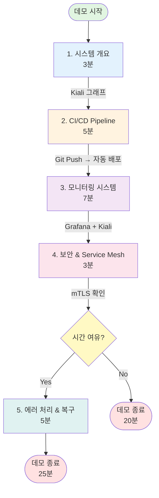

# 데모 시나리오

## 데모 개요

이 문서는 Cloud-Native Microservice 플랫폼 v2.0의 핵심 기능을 시연하기 위한 시나리오를 정의합니다. 전체 시스템의 안정성과 관측 가능성을 효과적으로 보여주는 것을 목표로 합니다.

**예상 소요 시간**: 20-25분

---

## 주요 시연 기능

- **CI/CD 자동화**: Git Push → GitHub Actions → Argo CD를 통한 5분 내 자동 배포
- **Service Mesh**: Istio를 통한 Service 간 통신 시각화 및 mTLS STRICT 보안
- **실시간 모니터링**: Prometheus + Grafana를 통한 Golden Signals 추적
- **로그 집계**: Loki를 활용한 중앙화된 로그 관리 및 추적
- **고가용성**: 자동 복구 및 스케일링

---

## 시나리오 흐름

### 데모 진행 순서도

### 1. 시스템 개요 확인 (3분)
- Kiali Service Graph를 통해 현재 배포된 Microservice 토폴로지 확인
- 프로젝트 배경 및 v1.0 대비 개선사항 설명
- 기술 스택 소개 (Terraform, GitOps, Istio, Prometheus)

### 2. CI/CD Pipeline 시연 (5분)
- 코드 변경 및 Git Push
- GitHub Actions 자동 실행 (빌드, 테스트, 보안 스캔)
- Argo CD 자동 동기화
- Kubernetes Pod 롤링 업데이트 확인

### 3. 모니터링 시스템 시연 (7분)
- **Grafana Golden Signals**: Latency, Traffic, Errors, Saturation 실시간 확인
- **Kiali**: Service 간 트래픽 흐름 및 mTLS 상태 시각화
- **부하 테스트**: 트래픽 급증 시뮬레이션 후 메트릭 변화 관찰
- **Loki 로그**: 특정 서비스 로그 조회 및 필터링

### 4. 보안 및 Service Mesh (3분)
- Istio mTLS STRICT 모드 확인
- GitHub Actions의 Trivy 보안 스캔 결과 검토

### 5. 에러 처리 및 복구 (선택사항, 5분)
- 의도적인 404 에러 발생
- Grafana에서 에러율 증가 추적
- Loki에서 에러 로그 분석
- Pod 강제 삭제 후 자동 재생성 확인

---

## 사전 준비 사항

### 환경 요구사항
- Kubernetes Cluster 실행 중
- 모든 Service가 titanium-prod, istio-system, monitoring Namespace에 배포됨
- Load Generator 배포로 지속적인 메트릭 생성

### 접속 정보
- **Grafana**: http://10.0.1.70:30300 (admin / admin123)
- **Kiali**: http://10.0.1.70:31200
- **애플리케이션**: http://10.0.1.70:31304
- **Prometheus**: http://10.0.1.70:30090

---

## 상세 시나리오

데모 발표를 위한 상세 스크립트, 명령어, 예상 질문 및 답변, 비상 대응 계획은 아래 Notion 페이지를 참고하세요:

**[Notion: 상세 데모 시나리오 및 발표 스크립트](https://www.notion.so/leestories/2ab6a7ec472880c2928ff9a86195f455)**

---

**최종 업데이트**: 2025년 11월 15일
