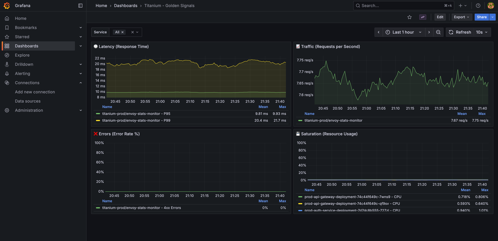

# 문서 탐색 가이드

Cloud-Native 마이크로서비스 플랫폼 v2.0 프로젝트의 전체 문서 구조와 탐색 방법을 안내합니다.

---

## 문서 구조 개요

이 프로젝트의 문서는 **프로젝트 진행 단계별**로 구성되어 있습니다. 각 단계별로 해당 시점의 작업 내용과 의사결정 과정을 확인할 수 있습니다.

```
docs/
├── 00-getting-started/     # 시작하기: 로컬 환경 설정
├── 01-planning/            # 1단계: 프로젝트 계획
├── 02-architecture/        # 2단계: 시스템 설계
├── 03-implementation/      # 3단계: 구현 요약
├── 04-operations/          # 4단계: 운영 및 시스템 관리
├── 05-troubleshooting/     # 5단계: 트러블슈팅 문서
├── 06-performance/         # 6단계: 성능 분석
├── 07-demo/                # 7단계: 데모 및 시연
└── 08-retrospective/       # 8단계: 프로젝트 회고
```

---

## 추천 탐색 순서

### 처음 방문하는 경우

프로젝트를 처음 접하는 경우, 다음 순서로 문서를 읽는 것을 권장합니다:

1. **프로젝트 개요 파악**
   - [루트 README.md](../README.md) - 프로젝트 소개 및 핵심 기능

2. **로컬 환경에서 실행하기**
   - [00-getting-started/GETTING_STARTED.md](00-getting-started/GETTING_STARTED.md) - Minikube 로컬 환경 설정

3. **요구사항 및 계획 이해**
   - [01-planning/requirements.md](01-planning/requirements.md) - 기능 요구사항
   - [01-planning/project-plan.md](01-planning/project-plan.md) - 개발 계획

4. **시스템 설계 확인**
   - [02-architecture/architecture.md](02-architecture/architecture.md) - 시스템 아키텍처
   - [02-architecture/adr/](02-architecture/adr/) - 주요 기술 결정 기록

5. **구현 과정 살펴보기**
   - [03-implementation/implementation-summary.md](03-implementation/implementation-summary.md) - 전체 구현 요약

6. **최종 성과 확인**
   - [04-operations/reports/final-status-report.md](04-operations/reports/final-status-report.md) - 프로젝트 최종 상태
   - [06-performance/k6-load-test-results.md](06-performance/k6-load-test-results.md) - 부하 테스트 결과
   - [06-performance/e2e-test-results.md](06-performance/e2e-test-results.md) - E2E 테스트 결과 (New)
   - [08-retrospective/project-retrospective.md](08-retrospective/project-retrospective.md) - 프로젝트 회고

### 특정 목적별 가이드

#### 실행 및 배포 방법을 알고 싶다면
- [00-getting-started/GETTING_STARTED.md](00-getting-started/GETTING_STARTED.md) - 로컬 환경 (Minikube) 설정 A-to-Z
- [루트 README.md](../README.md) → "시작하기" 섹션
- [04-operations/guides/token-auth-setup.md](04-operations/guides/token-auth-setup.md) - 인증 설정
- [terraform/README.md](../terraform/README.md) - 인프라 생성

#### 문제 해결 방법을 찾는다면
- [04-operations/guides/operations-guide.md](04-operations/guides/operations-guide.md) - 운영 가이드
- [04-operations/guides/security-configuration.md](04-operations/guides/security-configuration.md) - 보안 설정 가이드 (New)
- [05-troubleshooting/README.md](05-troubleshooting/README.md) - 트러블슈팅 가이드 인덱스 (모든 문제 해결 사례)

#### 기술적 의사결정 배경이 궁금하다면
- [02-architecture/adr/](02-architecture/adr/) - 모든 ADR 문서
  - [001-argocd-vs-flux.md](02-architecture/adr/001-argocd-vs-flux.md) - GitOps
  - [002-postgresql-vs-sqlite.md](02-architecture/adr/002-postgresql-vs-sqlite.md) - 데이터베이스
  - [003-loki-vs-efk.md](02-architecture/adr/003-loki-vs-efk.md) - 로깅
  - [004-github-actions-vs-jenkins.md](02-architecture/adr/004-github-actions-vs-jenkins.md) - CI/CD
  - [005-terraform-vs-pulumi.md](02-architecture/adr/005-terraform-vs-pulumi.md) - IaC
  - [006-istio-vs-linkerd.md](02-architecture/adr/006-istio-vs-linkerd.md) - Service Mesh
  - [007-prometheus-grafana-stack.md](02-architecture/adr/007-prometheus-grafana-stack.md) - 모니터링
  - [008-redis-cache.md](02-architecture/adr/008-redis-cache.md) - 캐시
  - [009-solid-cloud-platform.md](02-architecture/adr/009-solid-cloud-platform.md) - Kubernetes 플랫폼

#### 데모 준비를 한다면
- [07-demo/demo-scenario.md](07-demo/demo-scenario.md) - 20-25분 데모 시나리오

---

## 각 단계별 상세 설명

### 1단계: 계획 (01-planning/)

프로젝트 시작 전 수립한 요구사항과 개발 계획입니다.

| 문서 | 설명 |
|------|------|
| [requirements.md](01-planning/requirements.md) | Must/Should/Could-Have 요구사항 목록 |
| [project-plan.md](01-planning/project-plan.md) | 주차별 개발 계획 및 마일스톤 |

### 2단계: 설계 (02-architecture/)

시스템 아키텍처 설계와 주요 기술 선택의 의사결정 과정입니다.

| 문서 | 설명 |
|------|------|
| [architecture.md](02-architecture/architecture.md) | 전체 시스템 아키텍처, 컴포넌트 구조 |
| [adr/](02-architecture/adr/) | Architecture Decision Records (기술 결정 기록) |

**주요 기술 결정**:
- Argo CD vs Flux CD (GitOps)
- PostgreSQL vs SQLite (데이터베이스)
- Loki vs EFK (로깅)
- GitHub Actions vs Jenkins (CI/CD)
- Terraform vs Pulumi (IaC)
- Istio vs Linkerd (Service Mesh)
- Prometheus + Grafana (모니터링)
- Redis (캐시)
- Solid Cloud (Kubernetes 플랫폼)

### 3단계: 구현 (03-implementation/)

개발 과정에 대한 전체적인 요약입니다.

| 문서 | 설명 |
|------|------|
| [implementation-summary.md](03-implementation/implementation-summary.md) | 전체 구현 과정의 요약 및 핵심 내용 |

### 4단계: 운영 (04-operations/)

시스템 운영, 장애 대응, 보안 관리를 위한 실무 가이드입니다.

#### 운영 가이드 (guides/)
| 문서 | 설명 |
|------|------|
| [operations-guide.md](04-operations/guides/operations-guide.md) | 일상 운영 작업 및 모니터링 |
| [token-auth-setup.md](04-operations/guides/token-auth-setup.md) | Kubernetes Token 기반 인증 설정 |
| [SECRET_MANAGEMENT.md](04-operations/guides/SECRET_MANAGEMENT.md) | Secret 관리 방법 및 보안 고려사항 |
| [loki-log-volume-fix-guide.md](04-operations/guides/loki-log-volume-fix-guide.md) | Loki 로그 볼륨 문제 해결 가이드 |
| [performance-improvement-plan.md](04-operations/guides/performance-improvement-plan.md) | 성능 개선 계획 |
| [test-scenarios.md](04-operations/guides/test-scenarios.md) | 테스트 시나리오 |
| [ui-ux-improvements-deployment-guide.md](04-operations/guides/ui-ux-improvements-deployment-guide.md) | UI/UX 개선사항 배포 가이드 |

#### 보고서 (reports/)
| 문서 | 설명 |
|------|------|
| [final-status-report.md](04-operations/reports/final-status-report.md) | 프로젝트 최종 상태 보고서 |
| [comprehensive-test-report.md](04-operations/reports/comprehensive-test-report.md) | 종합 테스트 결과 보고서 |

#### 체크리스트 (checklists/)
| 문서 | 설명 |
|------|------|
| [comprehensive-test-checklist.md](04-operations/checklists/comprehensive-test-checklist.md) | 시스템 검증 체크리스트 |

### 5단계: 트러블슈팅 (05-troubleshooting/)

실제 발생한 모든 문제와 해결 방법을 카테고리별로 정리했습니다.

| 문서 | 설명 |
|------|------|
| [README.md](05-troubleshooting/README.md) | 트러블슈팅 가이드 메인 페이지 (모든 문제 해결 사례 인덱스) |
| [argocd/](05-troubleshooting/argocd/) | Argo CD 관련 문제 해결 |
| [ci-cd/](05-troubleshooting/ci-cd/) | CI/CD Pipeline 관련 문제 해결 |
| [istio/](05-troubleshooting/istio/) | Istio 서비스 메시 관련 문제 해결 |
| [kubernetes/](05-troubleshooting/kubernetes/) | Kubernetes 관련 문제 해결 |
| [monitoring/](05-troubleshooting/monitoring/) | Prometheus, Grafana, Loki 등 모니터링 관련 문제 해결 |

### 6단계: 성능 (06-performance/)

k6 부하 테스트를 통한 성능 측정 및 최적화 결과입니다.

| 문서 | 설명 |
|------|------|
| [k6-load-test-results.md](06-performance/k6-load-test-results.md) | 부하 테스트 결과 및 분석 |
| [e2e-test-results.md](06-performance/e2e-test-results.md) | E2E 테스트 시나리오 및 결과 |
| [errors-threshold-analysis.md](06-performance/errors-threshold-analysis.md) | 에러 임계값 분석 보고서 |

**주요 성과**:
- **K6 부하 테스트 (100 VU, 10분)**:
  - P95 Latency: 74.76ms
  - P90 Latency: 55.67ms
  - Error Rate: 0.01%
  - Check Success Rate: 99.95%
- **시스템 안정성**: 5xx/4xx 에러율 0% 유지
- HPA 최적화 및 성능 개선 (Phase 1+2)

**성능 개선 증명 자료:**

아래는 Grafana 대시보드에서 측정한 골든 시그널(Latency, Error Rate) 지표입니다. E2E 테스트에서 P95 Latency 200.5ms를 달성하고, 에러율이 0%를 유지하는 것을 확인할 수 있습니다.



더 상세한 성능 측정 과정과 분석 내용은 아래 보고서에서 확인하실 수 있습니다.

- [상세 성능 분석 보고서 (Load Test Results)](06-performance/k6-load-test-results.md)

### 7단계: 데모 (07-demo/)

프로젝트 시연을 위한 데모 시나리오와 준비 사항입니다.

| 문서 | 설명 |
|------|------|
| [demo-scenario.md](07-demo/demo-scenario.md) | 20-25분 데모 시나리오 (준비사항, 스크립트, 예상 질문) |

**데모 구성**:
1. 프로젝트 소개 (3분)
2. CI/CD Pipeline 시연 (5분)
3. 모니터링 시스템 (5분)
4. 보안 및 서비스 메시 (3분)
5. 에러 시나리오 및 모니터링 (5분)
6. 고가용성 및 자동 복구 (4분)

### 8단계: 회고 (08-retrospective/)

프로젝트 완료 후 작성한 회고록입니다.

| 문서 | 설명 |
|------|------|
| [project-retrospective.md](08-retrospective/project-retrospective.md) | 잘한 점, 아쉬운 점, 배운 점, 향후 계획 |

---

## 문서 작성 원칙

이 프로젝트의 모든 문서는 다음 원칙에 따라 작성되었습니다:

1. **시간순 기록**: 프로젝트 진행 순서에 따라 구조화되었습니다
2. **의사결정 과정 포함**: 단순한 결과뿐 아니라 "왜" 그렇게 결정했는지 기록했습니다
3. **실행 가능한 가이드**: 모든 명령어와 절차가 실제로 작동하도록 검증되었습니다
4. **문제 해결 과정 공유**: 발생한 문제와 해결 방법을 상세히 기록했습니다

---

## 빠른 참조

### 자주 찾는 문서

- **프로젝트 개요**: [../README.md](../README.md)
- **시스템 아키텍처**: [02-architecture/architecture.md](02-architecture/architecture.md)
- **운영 가이드**: [04-operations/guides/operations-guide.md](04-operations/guides/operations-guide.md)
- **트러블슈팅**: [05-troubleshooting/README.md](05-troubleshooting/README.md)
- **성능 분석**: [06-performance/k6-load-test-results.md](06-performance/k6-load-test-results.md)
- **최종 상태 보고서**: [04-operations/reports/final-status-report.md](04-operations/reports/final-status-report.md)

### 외부 리소스

- **GitHub Repository**: https://github.com/DvwN-Lee/Monitoring-v2
- **Docker Hub**: https://hub.docker.com/u/dongju101
- **Grafana 대시보드**: http://10.0.11.168:30300

---

**최종 업데이트**: 2025년 12월 14일