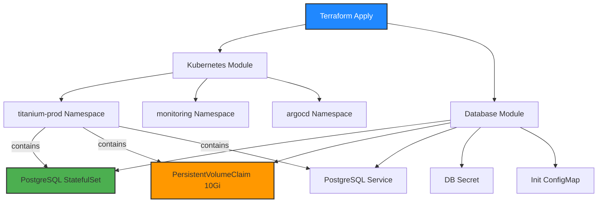

# Terraform Infrastructure as Code

Terraform 모듈을 사용하여 Solid Cloud 인프라를 자동화합니다.

## Terraform으로 생성되는 리소스

`terraform apply` 실행 시, Kubernetes Cluster 내에 다음과 같은 리소스들이 자동으로 생성됩니다:



**주요 생성 리소스:**
- **3개 Namespace**: titanium-prod, monitoring, argocd
- **PostgreSQL StatefulSet**: 1 replica, 10Gi PVC
- **Kubernetes Service**: PostgreSQL ClusterIP 서비스
- **Secret**: PostgreSQL 자격 증명
- **ConfigMap**: 데이터베이스 초기화 스크립트 (users, posts 테이블)

## 디렉토리 구조

```
terraform/
├── modules/
│   ├── network/          # VPC, Subnet, Security Group
│   ├── kubernetes/       # K8s Cluster & Namespaces
│   └── database/         # PostgreSQL StatefulSet
└── environments/
    └── solid-cloud/      # Solid Cloud 환경 설정
        ├── main.tf
        ├── variables.tf
        ├── terraform.tfvars.example
        └── outputs.tf
```

## 사용 방법

### 1. 사전 요구사항

```bash
# Terraform 설치 확인
terraform version  # v1.5.0 이상

# kubectl 설치 및 kubeconfig 설정
kubectl cluster-info

# Solid Cloud 접근 권한 확인
```

### 2. 환경 설정

```bash
cd terraform/environments/solid-cloud

# terraform.tfvars 파일 생성
cp terraform.tfvars.example terraform.tfvars

# 필수 변수 업데이트
vi terraform.tfvars
```

**terraform.tfvars 예시:**

```hcl
# PostgreSQL 설정
postgres_password = "your-strong-password-here"  # 강력한 비밀번호로 변경 필수
postgres_user     = "postgres"
postgres_db       = "titanium"

# Kubernetes 설정
kubeconfig_path = "~/.kube/config"  # kubeconfig 파일 경로

# Namespace 설정
app_namespace        = "titanium-prod"
monitoring_namespace = "monitoring"
argocd_namespace     = "argocd"

# PostgreSQL 리소스 설정
postgres_storage_size = "10Gi"
postgres_cpu_request  = "500m"
postgres_mem_request  = "1Gi"
postgres_cpu_limit    = "2000m"
postgres_mem_limit    = "2Gi"
```

**주의사항:**
- `postgres_password`는 반드시 강력한 비밀번호로 변경하세요
- `terraform.tfvars` 파일은 `.gitignore`에 포함되어 있어 Git에 커밋되지 않습니다
- 프로덕션 환경에서는 환경 변수나 Secret 관리 도구 사용을 권장합니다

### 3. Terraform 초기화

```bash
terraform init
```

### 4. 계획 확인

```bash
terraform plan
```

### 5. 인프라 생성

```bash
terraform apply

# 확인 메시지에서 'yes' 입력
```

### 6. 인프라 확인

```bash
# Terraform 출력 확인
terraform output

# Kubernetes 리소스 확인
kubectl get ns
kubectl get pods -n titanium-prod
kubectl get svc -n titanium-prod
```

## 모듈 설명

### Network Module

VPC, Subnet, Security Group, Load Balancer를 관리합니다.

**주요 리소스:**
- VPC (10.0.0.0/16)
- Public Subnets (3개)
- Private Subnets (3개)
- Security Group (HTTP, HTTPS, PostgreSQL)

### Kubernetes Module

Kubernetes Cluster와 Namespace를 관리합니다.

**생성되는 Namespace:**
- `titanium-prod`: 애플리케이션 서비스
- `monitoring`: Prometheus, Grafana
- `argocd`: Argo CD

### Database Module

PostgreSQL을 StatefulSet으로 배포합니다.

**주요 리소스:**
- PostgreSQL StatefulSet (1 replica)
- PersistentVolumeClaim (10Gi)
- Secret (DB 자격 증명)
- ConfigMap (초기화 스크립트)
- Service (ClusterIP)

**초기화 스크립트:**
- users 테이블 생성
- posts 테이블 생성
- 인덱스 생성

## 보안 고려사항

### Secrets 관리

```bash
# terraform.tfvars는 절대 Git에 커밋하지 마세요
echo "*.tfvars" >> .gitignore

# 민감한 변수는 환경 변수로 설정 가능
export TF_VAR_postgres_password="your-secure-password"
terraform apply
```

### State 파일 관리

```bash
# 로컬 state 파일도 민감 정보 포함
# 프로덕션에서는 원격 backend 사용 권장

# S3 backend 예시 (main.tf)
terraform {
  backend "s3" {
    bucket = "titanium-terraform-state"
    key    = "solid-cloud/terraform.tfstate"
    region = "us-east-1"
  }
}
```

## 테스트

### PostgreSQL 연결 테스트

```bash
# Pod 내부에서 psql 실행
kubectl exec -it postgresql-0 -n titanium-prod -- psql -U postgres -d titanium

# 테이블 확인
\dt

# 샘플 쿼리
SELECT * FROM users;
SELECT * FROM posts;
```

### 서비스 연결 테스트

```bash
# PostgreSQL 서비스 확인
kubectl get svc postgresql-service -n titanium-prod

# 임시 Pod으로 연결 테스트
kubectl run -it --rm debug --image=postgres:15-alpine --restart=Never -n titanium-prod -- \
  psql -h postgresql-service -U postgres -d titanium
```

## 업데이트 및 변경

```bash
# 변수 수정 후
vi terraform.tfvars

# 변경사항 확인
terraform plan

# 적용
terraform apply
```

## 인프라 삭제

```bash
# 주의: 모든 리소스가 삭제됩니다
terraform destroy

# 확인 메시지에서 'yes' 입력
```

## 트러블슈팅

### 1. Kubernetes Provider 연결 실패

```bash
# kubeconfig 확인
kubectl config current-context
kubectl cluster-info

# kubeconfig 경로 확인
echo $KUBECONFIG
```

### 2. PostgreSQL Pod이 Running 상태가 아님

```bash
# Pod 로그 확인
kubectl logs postgresql-0 -n titanium-prod

# Pod 상태 확인
kubectl describe pod postgresql-0 -n titanium-prod

# PVC 상태 확인
kubectl get pvc -n titanium-prod
```

### 3. Terraform State Lock 오류

```bash
# State lock 강제 해제 (신중하게 사용)
terraform force-unlock <LOCK_ID>
```

## 참고 문서

- [Terraform 공식 문서](https://www.terraform.io/docs)
- [Kubernetes Provider 문서](https://registry.terraform.io/providers/hashicorp/kubernetes/latest/docs)
- [PostgreSQL 공식 문서](https://www.postgresql.org/docs/)

## 기여

Terraform 모듈 개선 사항이나 버그는 Issue로 등록해주세요.
